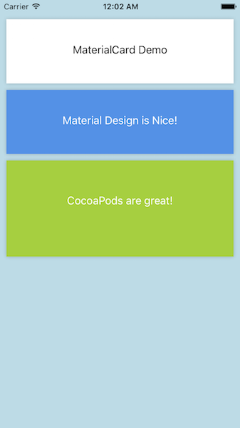

# MaterialCard

[](http://cocoapods.org/pods/MaterialCard)
[](http://cocoapods.org/pods/MaterialCard)
[](http://cocoapods.org/pods/MaterialCard)

An iOS CocoaPod that provides a MaterialCard class for creating Card Views based on the Material Design spec.

| Screenshot |
| :---: |
|  |

## Installation

MaterialCard is available through [CocoaPods](http://cocoapods.org). To install
it, simply add the following line to your Podfile:

```ruby
pod "MaterialCard"
```

## Usage

To run the example project, clone the repo, and run `pod install` from the Example directory first.

```
let card = MaterialCard(frame: CGRect(x: 10, y: UIApplication.shared.statusBarFrame.size.height + 10, width: UIApplication.shared.statusBarFrame.size.width - 20, height: 100))

let label = UILabel(frame: CGRect(x: 0, y: 37, width: c.frame.size.width, height: 21))
label.textAlignment = NSTextAlignment.Center
label.text = "MaterialCard Demo"

card.backgroundColor = UIColor.white
card.shadowOpacity = 0.2
card.shadowOffsetHeight = 0
card.cornerRadius = 0
card.addSubview(label)

self.view.addSubview(card)

```


## Authors

* Andrew Clissold, andrewclissold@gmail.com
* Nathan Walker, walkerrunpdx@gmail.com

## License

MaterialCard is available under the MIT license. See the LICENSE file for more info.